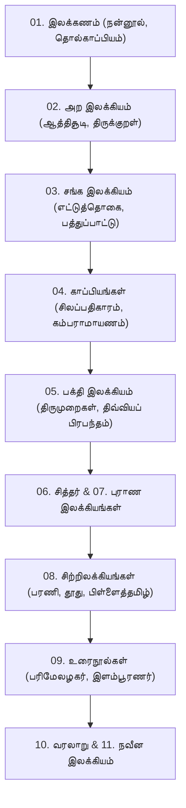

# 📖 தமிழ் இலக்கியப் பயில்நெறி & வாசிப்பு வரிசை வழிகாட்டி (Best Reading Order Guide)

> **சுதந்திரத் தமிழ் நூலகக் களஞ்சியம் (Sutantra Tamil Digital Library)**  
> *பாரம்பரியப் புலமை நெறி (Classical Scholar Order) மற்றும் பயில்முறைத் தளங்களை அடிப்படையாகக் கொண்ட செவ்வியல் வாசிப்பு வழிகாட்டி.*

---

## 🏛️ மரபுவழிக் கற்றல் வரிசை (The Classical Scholar Order)

தமிழ் இலக்கியக் கல்வியில் மரபுவழியாகக் கடைப்பிடிக்கப்பட்டு வந்த முறைமை **விதி $\rightarrow$ அறம் $\rightarrow$ இலக்கியம் $\rightarrow$ நுண்கலை $\rightarrow$ தத்துவம்** என்ற படிநிலையைக் கொண்டதாகும். 

1. **இலக்கணம் (Grammar & Poetics)**: சொற்களின் கட்டமைப்பு, புணர்ச்சி, யாப்பு (யாப்பிலக்கணம்), அணி (அணியிலக்கணம்) ஆகியவற்றின் விதிகளை முதலில் அறிவதன் மூலமே பழமையான செய்யுள்களைச் பிழையின்றிப் பிரித்துப் பொருள் உணர முடியும்.
2. **அறம் (Ethics & Didactic Literature)**: மொழியறிவோடு வாழ்வியல் நெறிமுறைகளையும் சுருக்கமான வெண்பா/குறள் அடிகளில் கற்பித்தல்.
3. **சங்க இலக்கியம் (Classical Sangam Poetry)**: விதிகளையும் அறத்தையும் கற்ற மாணவன், தமிழின் உன்னதப் பொற்காலச் செய்யுள்களான அகம் மற்றும் புறப் பாடல்களைச் சுவைக்கத் தொடங்குகிறான்.
4. **காப்பியங்கள் (Epic Narratives)**: விழுமியங்களையும் செய்யுள் நயங்களையும் முழுமையான வாழ்வியல் கதைப் பின்னணியில் அமைத்துக் கூறும் பேரிலக்கியங்கள்.
5. **பக்தி, சித்தர் & புராணங்கள் (Devotion, Mysticism & Puranas)**: உள்ளுணர்வு, பக்திப் பரவசம், உடல்தோய்ந்த ஞானம், புராணக் கதைக் களஞ்சியங்கள்.
6. **சிற்றிலக்கியங்கள் (Minor Literary Forms - Prabandhas)**: உலா, தூது, பரணி, பிள்ளைத்தமிழ், பள்ளு, குறவஞ்சி போன்ற 96 வகைச் சிற்றிலக்கிய வடிவங்கள்.
7. **உரைநூல்கள் (Commentary Literature)**: பண்டைத் தமிழ் நூல்களுக்கு உரையாசிரியர்கள் கண்ட ஆழமான விளக்கங்கள்.
8. **வரலாறு, நவீன இலக்கியம் & மொழிபெயர்ப்புகள்**: கல்வெட்டு-சாசன ஆய்வுகள், தற்காலப் புதினங்கள், சிறுகதைகள் மற்றும் பிறமொழிச் செவ்வியல் படைப்புகள்.

---

## 🧭 நான்கு முதன்மை வாசிப்புத் தடங்கள் (Four Tailored Reading Pathways)

### 🎓 பாதை 1: மரபுவழிப் புலமை நெறி (Classical Scholar Pathway)
*ஆழமான தமிழ் இலக்கண-இலக்கியப் புலமை பெற விரும்புவோருக்கான முழுமையான வரிசை.*

---

### 🌱 பாதை 2: எளிய தொடக்க வாசகர் நெறி (Beginner / Casual Reader Pathway)
*தமிழின் இனிமையைச் சுவைத்து வாசிப்புப் பழக்கத்தை வளர்த்துக் கொள்ள விரும்புவோருக்கான எளிய வரிசை.*

1. **படி 1: நீதி நூல்கள்**:  
   - [ஆத்திசூடி](02_ara_ilakkiyam/01_neethi_noolkal/01_aaththisooti.md), [கொன்றை வேந்தன்](02_ara_ilakkiyam/01_neethi_noolkal/02_konrai_venthan.md), [மூதுரை](02_ara_ilakkiyam/01_neethi_noolkal/03_moothurai.md), [நல்வழி](02_ara_ilakkiyam/01_neethi_noolkal/04_nalvazhi.md).  
   - [திருக்குறள்](03_sangka_ilakkiyam/02_pathinenkeezhkanakku/01_aranoolkal/01_thirukkural.md) (அறத்துப்பால் & பொருட்பால் முக்கிய அதிகாரங்கள்).
2. **படி 2: நவீன வரலாற்றுப் புதினங்கள் & சிறுகதைகள்**:  
   - கல்கியின் வரலாற்றுப் புதினங்கள் ([11_naveena_ilakkiyam/01_puthinangkal](11_naveena_ilakkiyam/01_puthinangkal/README.md)).  
   - புதுமைப்பித்தன், கு.ப.ரா. சிறுகதைகள் ([11_naveena_ilakkiyam/02_sirukathaikal](11_naveena_ilakkiyam/02_sirukathaikal/README.md)).  
   - மகாகவி பாரதியார் கவிதைகள் ([11_naveena_ilakkiyam/03_kavithaikal](11_naveena_ilakkiyam/03_kavithaikal/README.md)).
3. **படி 3: கதை தழுவிய காப்பியங்கள்**:  
   - [சிலப்பதிகாரம்](04_kaappiyangkal/01_aimperungkaappiyangkal/01_silappathikaaram.md) & [மணிமேகலை](04_kaappiyangkal/01_aimperungkaappiyangkal/02_manimekalai.md).
4. **படி 4: எளிய சிற்றிலக்கியங்கள்**:  
   - குற்றாலக் குறவஞ்சி ([08_sirrilakkiyangkal/13_kuravanjsi](08_sirrilakkiyangkal/13_kuravanjsi/README.md)).  
   - முக்கூடற்பள்ளு ([08_sirrilakkiyangkal/12_pallu](08_sirrilakkiyangkal/12_pallu/README.md)).  
   - தமிழ்விடு தூது ([08_sirrilakkiyangkal/07_thoothu](08_sirrilakkiyangkal/07_thoothu/README.md)).

---

### 🕊️ பாதை 3: ஆன்மீக & மெய்யியல் நெறி (Spiritual & Philosophical Pathway)
*தமிழின் பக்தி, இறையுணர்வு மற்றும் மெய்யியல் தத்துவங்களை ஆழமாகக் கற்க விரும்புவோருக்கான வரிசை.*

1. **பன்னிரு திருமுறைகள் (சைவம்)**:  
   - [தேவாரம்](05_pakthi_ilakkiyam/01_saivam/01_panniru_thirumuraigal/01_thevaaram.md) (திருஞானசம்பந்தர், திருநாவுக்கரசர், சுந்தரர்).  
   - [திருவாசகம்](05_pakthi_ilakkiyam/01_saivam/01_panniru_thirumuraigal/08_thiruvaasakam.md) (மாணிக்கவாசகர்).  
   - [பெரியபுராணம்](05_pakthi_ilakkiyam/01_saivam/01_panniru_thirumuraigal/12_periyapuraanam.md) (சேக்கிழார்).  
   - [திருவருட்பா](05_pakthi_ilakkiyam/01_saivam/04_thiruvarutpa/README.md) (வள்ளலார்).
2. **நாலாயிர திவ்வியப் பிரபந்தம் (வைணவம்)**:  
   - திருப்பாவை, திருவெம்பாவை, திருவாய்மொழி ([05_pakthi_ilakkiyam/02_vainavam](05_pakthi_ilakkiyam/02_vainavam/README.md)).
3. **சித்தர் இலக்கியம் & ஞானப் பாடல்கள்**:  
   - பட்டினத்தார் பாடல்கள் ([06_siththar_ilakkiyam/01_siththar_paatalkal/03_pattanaththuppillaiyaar_paatalkal.md](06_siththar_ilakkiyam/01_siththar_paatalkal/03_pattanaththuppillaiyaar_paatalkal.md)), தாயுமானவர் திருப்பாடல்கள் ([06_siththar_ilakkiyam/01_siththar_paatalkal/02_thaayumaanavar_paatalkal.md](06_siththar_ilakkiyam/01_siththar_paatalkal/02_thaayumaanavar_paatalkal.md)).  
   - பெரிய ஞானக்கோவை ([06_siththar_ilakkiyam/01_siththar_paatalkal/01_periya_njaanakkovai.md](06_siththar_ilakkiyam/01_siththar_paatalkal/01_periya_njaanakkovai.md)), சித்த மருத்துவம் & வாசியோகம் ([06_siththar_ilakkiyam](06_siththar_ilakkiyam/README.md)).
4. **புராணங்கள்**:  
   - [கந்தபுராணம்](07_puraanangkal/01_puraanangkal/README.md) & [திருவிளையாடற் புராணம்](07_puraanangkal/01_puraanangkal/README.md).

---

### 📜 பாதை 4: வரலாற்று & தொல்லியல் ஆய்வு நெறி (Historical & Epigraphical Pathway)
*தமிழக வரலாறு, அரச மரபுகள், சமூகப் பண்பாட்டு மாற்றங்கள் குறித்து ஆய்வு செய்வோருக்கான வரிசை.*

1. **சங்க இலக்கியப் புறப்பாடல்கள்**:  
   - [புறநானூறு](03_sangka_ilakkiyam/01_pathinenmerkkanakku/01_ettuththokai/08_puranaanooru.md) (மூவேந்தர், குறுநில மன்னர்கள், போரியல், பண்பாடு).  
   - [பதிற்றுப்பத்து](03_sangka_ilakkiyam/01_pathinenmerkkanakku/01_ettuththokai/04_pathitruppaththu.md) (சேர மன்னர்களின் வரலாறு).  
   - [மதுரைக்காஞ்சி](03_sangka_ilakkiyam/01_pathinenmerkkanakku/02_paththuppaattu/06_maduraikkaanjsi.md) & [பட்டினப்பாலை](03_sangka_ilakkiyam/01_pathinenmerkkanakku/02_paththuppaattu/09_pattinappaalai.md) (பாண்டிய, சோழ நகர நாகரிகம்).
2. **வரலாற்று ஆவணங்கள் & கல்வெட்டுகள்**:  
   - தமிழக வரலாற்று நூல்கள் ([10_varalaaru/01_thamizhaka_varalaaru](10_varalaaru/01_thamizhaka_varalaaru/README.md)).  
   - கல்வெட்டுகள், செப்பேடுகள், சாசனத் தொகுப்புகள்.
3. **சான்றோர் வாழ்க்கை வரலாறுகள்**:  
   - தமிழறிஞர்களின் வரலாறுகள் & சுயசரிதைகள் ([10_varalaaru/02_vaazhkkai_varalaaru](10_varalaaru/02_vaazhkkai_varalaaru/README.md)).

---

## 📚 12 துறைகளின் விரிவான வாசிப்பு வரிசை அட்டவணை

| துறை எண் | துறையின் பெயர் | தொடக்க நிலை நூல்கள் | இடைநிலை நூல்கள் | உயர்நிலை / ஆய்வு நூல்கள் |
| :---: | :--- | :--- | :--- | :--- |
| **01** | [01. இலக்கணம்](01_ilakkanam/README.md) | [நன்னூல்](01_ilakkanam/02_pirkaala_ilakkanam/05_nannool.md) | [யாப்பருங்கலக்காரிகை](01_ilakkanam/03_yaappu/03_yaapparungkalakkaarikai.md), [தண்டியலங்காரம்](01_ilakkanam/04_ani/01_thantiyalangkaaram.md) | [தொல்காப்பியம்](01_ilakkanam/01_tholkaappiyam/01_tholkaappiyam.md) (எழுத்து, சொல், பொருள்) |
| **02** | [02. அற இலக்கியம்](02_ara_ilakkiyam/README.md) | [ஆத்திசூடி](02_ara_ilakkiyam/01_neethi_noolkal/01_aaththisooti.md), [கொன்றைவேந்தன்](02_ara_ilakkiyam/01_neethi_noolkal/02_konrai_venthan.md), [மூதுரை](02_ara_ilakkiyam/01_neethi_noolkal/03_moothurai.md) | [உலகநீதி](02_ara_ilakkiyam/02_pirkaala_aranoolkal/04_ulakaneethi.md), [வெற்றிவேற்கை](02_ara_ilakkiyam/02_pirkaala_aranoolkal/03_verriverkai.md) | [அறநெறிச்சாரம்](02_ara_ilakkiyam/02_pirkaala_aranoolkal/02_aranerissaaram.md), [திருவள்ளுவமாலை](02_ara_ilakkiyam/02_pirkaala_aranoolkal/01_thiruvalluvamaalai.md) |
| **03** | [03. சங்க இலக்கியம்](03_sangka_ilakkiyam/README.md) | [திருக்குறள்](03_sangka_ilakkiyam/02_pathinenkeezhkanakku/01_aranoolkal/01_thirukkural.md), [குறுந்தொகை](03_sangka_ilakkiyam/01_pathinenmerkkanakku/01_ettuththokai/02_kurunthokai.md), [முல்லைப்பாட்டு](03_sangka_ilakkiyam/01_pathinenmerkkanakku/02_paththuppaattu/05_mullaippaattu.md) | [நற்றிணை](03_sangka_ilakkiyam/01_pathinenmerkkanakku/01_ettuththokai/01_narrinai.md), [நாலடியார்](03_sangka_ilakkiyam/02_pathinenkeezhkanakku/01_aranoolkal/02_naalatiyaar.md), [நெடுநல்வாடை](03_sangka_ilakkiyam/01_pathinenmerkkanakku/02_paththuppaattu/07_netunalvaatai.md) | [புறநானூறு](03_sangka_ilakkiyam/01_pathinenmerkkanakku/01_ettuththokai/08_puranaanooru.md), [அகநானூறு](03_sangka_ilakkiyam/01_pathinenmerkkanakku/01_ettuththokai/07_akanaanooru.md), [கலித்தொகை](03_sangka_ilakkiyam/01_pathinenmerkkanakku/01_ettuththokai/06_kaliththokai.md) |
| **04** | [04. காப்பியங்கள்](04_kaappiyangkal/README.md) | [சிலப்பதிகாரம்](04_kaappiyangkal/01_aimperungkaappiyangkal/01_silappathikaaram.md) | [மணிமேகலை](04_kaappiyangkal/01_aimperungkaappiyangkal/02_manimekalai.md), [கம்பராமாயணம்](04_kaappiyangkal/03_kamparaamaayanam/README.md) | [சீவக சிந்தாமணி](04_kaappiyangkal/01_aimperungkaappiyangkal/03_seevakasinthaamani.md), [சீறாப்புராணம்](04_kaappiyangkal/04_seeraappuraanam/README.md) |
| **05** | [05. பக்தி இலக்கியம்](05_pakthi_ilakkiyam/README.md) | [திருவாசகம்](05_pakthi_ilakkiyam/01_saivam/01_panniru_thirumuraigal/08_thiruvaasakam.md), [திருப்பாவை](05_pakthi_ilakkiyam/02_vainavam/README.md) | [தேவாரம்](05_pakthi_ilakkiyam/01_saivam/01_panniru_thirumuraigal/01_thevaaram.md), [நாலாயிர திவ்வியப் பிரபந்தம்](05_pakthi_ilakkiyam/02_vainavam/README.md) | [பெரியபுராணம்](05_pakthi_ilakkiyam/01_saivam/01_panniru_thirumuraigal/12_periyapuraanam.md), [சிவஞானபோதம்](05_pakthi_ilakkiyam/01_saivam/02_saiva_siddhantha_saaththirangkal/README.md) |
| **06** | [06. சித்தர் இலக்கியம்](06_siththar_ilakkiyam/README.md) | [பட்டினத்தார் பாடல்கள்](06_siththar_ilakkiyam/01_siththar_paatalkal/03_pattanaththuppillaiyaar_paatalkal.md) | [தாயுமானவர் பாடல்கள்](06_siththar_ilakkiyam/01_siththar_paatalkal/02_thaayumaanavar_paatalkal.md) | [சித்தர் ஞானக்கோவை](06_siththar_ilakkiyam/01_siththar_paatalkal/01_periya_njaanakkovai.md), [போகர் 7000](06_siththar_ilakkiyam/02_maruththuvam/01_pokar_7000.md) |
| **07** | [07. புராணங்கள்](07_puraanangkal/README.md) | [திருவிளையாடற் புராணம்](07_puraanangkal/01_puraanangkal/README.md) | [கந்தபுராணம்](07_puraanangkal/01_puraanangkal/README.md), [காஞ்சிப் புராணம்](07_puraanangkal/01_puraanangkal/README.md) | [தலபுராணங்கள்](07_puraanangkal/02_sthalapuraanangkal/README.md) (15 தலங்கள்) |
| **08** | [08. சிற்றிலக்கியங்கள்](08_sirrilakkiyangkal/README.md) | [குற்றாலக் குறவஞ்சி](08_sirrilakkiyangkal/13_kuravanjsi/README.md), [முக்கூடற்பள்ளு](08_sirrilakkiyangkal/12_pallu/README.md) | [கலிங்கத்துப் பரணி](08_sirrilakkiyangkal/09_parani/README.md), [தமிழ்விடு தூது](08_sirrilakkiyangkal/07_thoothu/README.md) | [மூவருலா](08_sirrilakkiyangkal/06_ulaa/README.md), [பிள்ளைத்தமிழ் நூல்கள்](08_sirrilakkiyangkal/05_pillaiththamizh/README.md) |
| **09** | [09. உரைநூல்கள்](09_urainoolkal/README.md) | நவீனுரைகள் ([09_urainoolkal/02_naveena_uraikal](09_urainoolkal/02_naveena_uraikal/README.md)) | திருக்குறள் உரைகள் ([09_urainoolkal/01_pazhaiya_uraikal](09_urainoolkal/01_pazhaiya_uraikal/README.md)) | தொல்காப்பியப் பழைய உரைகள் (இளம்பூரணர், நச்சினார்க்கினியர்) |
| **10** | [10. வரலாறு](10_varalaaru/README.md) | சான்றோர் சுயசரிதைகள் ([10_varalaaru/02_vaazhkkai_varalaaru](10_varalaaru/02_vaazhkkai_varalaaru/README.md)) | சேர, சோழ, பாண்டியர் வரலாறு ([10_varalaaru/01_thamizhaka_varalaaru](10_varalaaru/01_thamizhaka_varalaaru/README.md)) | கல்வெட்டுகள், மெய்க்கீர்த்திகள், செப்பேடுகள் |
| **11** | [11. நவீன இலக்கியம்](11_naveena_ilakkiyam/README.md) | பாரதியார் கவிதைகள், சிறுகதைகள் ([11_naveena_ilakkiyam/02_sirukathaikal](11_naveena_ilakkiyam/02_sirukathaikal/README.md)) | வரலாற்றுப் புதினங்கள் ([11_naveena_ilakkiyam/01_puthinangkal](11_naveena_ilakkiyam/01_puthinangkal/README.md)) | நவீன நாடகங்கள், இலக்கியத் திறனாய்வுக் கட்டுரைகள் |
| **12** | [12. மொழிபெயர்ப்புகள்](12_mozhipeyarppukal/README.md) | உலக இலக்கியச் சிறுகதைகள் | உலகச் செவ்விலக்கியங்கள் ([12_mozhipeyarppukal/01_ulaka_ilakkiyangkal](12_mozhipeyarppukal/01_ulaka_ilakkiyangkal/README.md)) | திருவிவிலியம், பகவத் கீதை, தத்துவ மொழிபெயர்ப்புகள் |

---

[⬅️ முதன்மைப் பக்கத்திற்குத் திரும்புக (Back to Archive Index)](../README.md)
